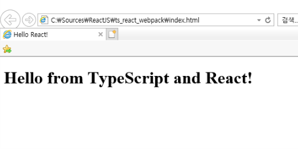

# Typescript & React & webpack

이 글은 typescript tutorials를 바탕으로 연습한 기초 프로젝트이다.

> https://typescript-kr.github.io/pages/tutorials/React%20&%20Webpack.html

```bash
npm init
npm install -g webpack
npm install --save-dev webpack 
npm install --save react react-dom @types/react @types/react-dom
npm install --save-dev typescript awesome-typescript-loader source-map-loader
```

- tsconfig.json 파일 추가 `/tsconfig.json`
```json
{
    "compilerOptions": {
        "outDir": "./dist/",
        "sourceMap": true,
        "noImplicitAny": true,
        "module": "commonjs",
        "target": "es5",
        "jsx": "react"
    },
    "include": [
        "./src/**/*"
    ]
}
```

- 출력 component 작성 `/src/component/hello.tsx`
```react
import * as React from "react";

export interface HelloProps { compiler: string; framework: string; }

// 'HelloProps'는 props의 형태을 만듭니다.
// State가 설정되어 있지 않아 '{}'타입을 사용합니다.
export class Hello extends React.Component<HelloProps, {}> {
    render() {
        return <h1>Hello from {this.props.compiler} and {this.props.framework}!</h1>;
    }
}
```

- index.tsx  작성 `/src/index.tsx`
```react
import * as React from "react";
import * as ReactDOM from "react-dom";

import { Hello } from "./components/Hello";

ReactDOM.render(
    <Hello compiler="TypeScript" framework="React" />,
    document.getElementById("example")
);
```

- index.html 작성 `/index.html`
```html
<!DOCTYPE html>
<html>
    <head>
        <meta charset="UTF-8" />
        <title>Hello React!</title>
    </head>
    <body>
        <div id="example"></div>

        <!-- Dependencies -->
        <script src="./node_modules/react/umd/react.development.js"></script>
        <script src="./node_modules/react-dom/umd/react-dom.development.js"></script>

        <!-- Main -->
        <script src="./dist/bundle.js"></script>
    </body>
</html>
```

- webpack 설정 파일 작성 `/webpack.config.js`
```javascript
module.exports = {
    entry: "./src/index.tsx",
    output: {
        filename: "bundle.js",
        path: __dirname + "/dist"
    },

    // webpack의 출력을 디버깅 할 소스 맵을 사용하도록 설정합니다.
    devtool: "source-map",

    resolve: {
        // 확인 가능한 확장자로 '.ts' 및 '.tsx'를 추가합니다.
        extensions: [".ts", ".tsx", ".js", ".json"]
    },

    module: {
        rules: [
            // '.ts' 또는 '.tsx' 확장자를 가진 모든 파일은 'awesome-typescript-loader'에 의해 처리됩니다.
            { test: /\.tsx?$/, loader: "awesome-typescript-loader" },

            // '.js' 파일의 모든 출력에는 'source-maps-loader'로 다시 처리된 소스 맵이 있습니다.
            { enforce: "pre", test: /\.js$/, loader: "source-map-loader" }
        ]
    },

    // 경로가 다음 중 하나와 일치하는 모듈을 임포트 경우
    // 해당하는 글로벌 변수가 있다고 가정하고 대신 사용하세요.
    // 이는 브라우저가 빌드와 라이브러리 사이에 캐시 할 수 있게 해주는
    // 모든 종속성을 번들로 묶는 것을 피할 수 있기 때문에 중요합니다.
    externals: {
        "react": "React",
        "react-dom": "ReactDOM"
    },
};
```

- 마지막으로 빌드
```
webpack
```

이 후 index.html을 브라우져에서 확인하면 아래와 같이 표시되어야 한다.



---

## Webpack

### Production & Development

- Install Webpack-merge (Webpack 파일을 합쳐준다.)

  ```bash
  npm install --save-dev webpack-merge
  ```

- 아래와 같이 파일을 나누면 된다.

  ```
    webpack-demo
    |- package.json
  - |- webpack.config.js
  + |- webpack.common.js
  + |- webpack.dev.js
  + |- webpack.prod.js
    |- /dist
    |- /src
      |- index.js
      |- math.js
    |- /node_modules
  ```

- webpack.common.js

  ```javascript
  module.exports = {
      entry: "./src/index.tsx",
      output: {
          filename: "bundle.js",
          path: __dirname + "/dist"
      },
  
      resolve: {
          // 확인 가능한 확장자로 '.ts' 및 '.tsx'를 추가합니다.
          extensions: [".ts", ".tsx", ".js", ".json"]
      },
  
      module: {
          rules: [
              // '.ts' 또는 '.tsx' 확장자를 가진 모든 파일은 'awesome-typescript-loader'에 의해 처리됩니다.
              { test: /\.tsx?$/, loader: "awesome-typescript-loader" },
  
              // '.js' 파일의 모든 출력에는 'source-maps-loader'로 다시 처리된 소스 맵이 있습니다.
              { enforce: "pre", test: /\.js$/, loader: "source-map-loader" }
          ]
      },
  
      // 경로가 다음 중 하나와 일치하는 모듈을 임포트 경우
      // 해당하는 글로벌 변수가 있다고 가정하고 대신 사용하세요.
      // 이는 브라우저가 빌드와 라이브러리 사이에 캐시 할 수 있게 해주는
      // 모든 종속성을 번들로 묶는 것을 피할 수 있기 때문에 중요합니다.
      externals: {
          "react": "React",
          "react-dom": "ReactDOM"
      },
  };
  ```

- webpack.dev.js

  ```javascript
  const merge = require('webpack-merge');
  const common = require('./webpack.common.js');
  
  module.exports = merge(common, {
      mode: 'development',
  
      // webpack의 출력을 디버깅 할 소스 맵을 사용하도록 설정합니다.
      devtool: "inline-source-map",
  
      devServer: {
          inline: true,
          hot: true
      },
  });
  ```

- webpack.prod.js

  ```javascript
  const webpack = require('webpack');
  const merge = require('webpack-merge');
  const common = require('./webpack.common.js');
  
  module.exports = merge(common, {
      mode: 'production',
      devtool: 'source-map',
      plugins: [
          new webpack.DefinePlugin({
              'process.env.NODE_ENV': JSON.stringify('production')
          })
      ]
  });
  ```

### Clean for webpack

- Insall [clean-webpack-plugin](https://github.com/johnagan/clean-webpack-plugin) (Webpack Directory를 초기화한다.)

  ```bash
  npm install --save-dev clean-webpack-plugin
  ```

- webpack.common.js 변경

  ```javascript
  + const CleanWebpackPlugin = require('clean-webpack-plugin');
  
  module.exports = {
      entry: "./src/index.tsx",
  +   plugins: [
  +       new CleanWebpackPlugin(['dist']),
  +   ]
  }
  ```

  

### Hot Module Replacement (HMR)

